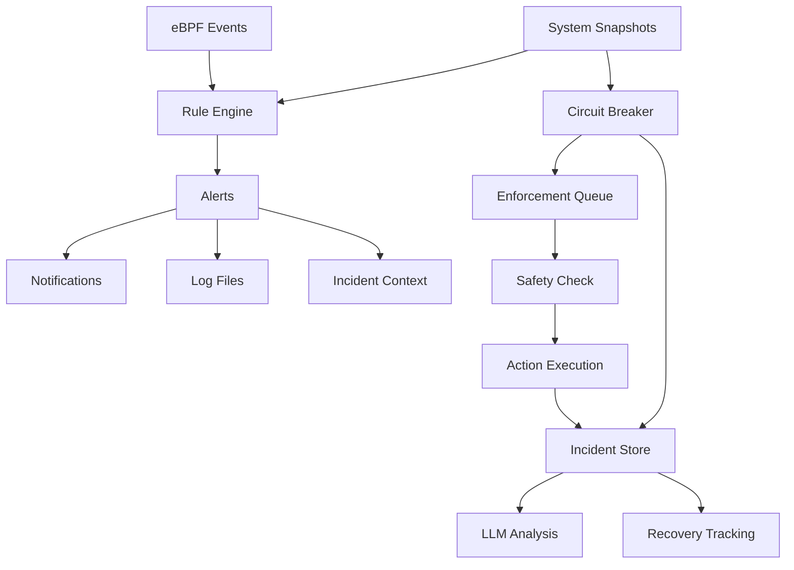

# Alert and Incident Architecture Analysis

This document provides a detailed analysis of how Linnix handles alerts, incidents, and enforcement actions.

## Overview

Linnix implements a multi-layered detection and response system with three primary components:

1. **Alerts** - Rule-based event detection and notification
2. **Incidents** - Persistent records of system events and actions taken
3. **Enforcement** - Safety-gated automatic remediation actions

## Alert System

### Alert Structure

```rust
pub struct Alert {
    pub rule: String,      // Rule name that triggered
    pub severity: Severity, // Info, Low, Medium, High
    pub message: String,   // Human-readable description
    pub host: String,      // Host where alert occurred
}
```

### Alert Generation Flow

1. **Rule Engine** processes events and system snapshots
2. **Detectors** evaluate conditions against thresholds
3. **Cooldown periods** prevent alert spam
4. **Broadcast** to all subscribers (notifications, logging, etc.)

### Supported Detectors

| Detector | Purpose | Triggers On |
|----------|---------|-------------|
| `ForksPerSec` | Detect fork bombs | Sustained fork rate > threshold |
| `ForkBurst` | Detect rapid fork bursts | Total forks in window > threshold |
| `ShortJobFlood` | Detect rapid exec/exit cycles | Short-lived processes > threshold |
| `RunawayTree` | Detect process tree explosion | Tree growth > threshold |
| `SubtreeCpuPct` | Detect CPU abuse | CPU usage > threshold sustained |
| `SubtreeRssMb` | Detect memory leaks | RSS usage > threshold sustained |

### Alert Destinations

- **Log Files** (`alerts_file` config)
- **journald** (if enabled)
- **Slack** (webhook notifications)
- **Apprise** (multi-platform notifications)
- **Incident Context Log** (for correlation)

## Incident System

### Incident Structure

```rust
pub struct Incident {
    pub id: Option<i64>,
    pub timestamp: i64,
    pub event_type: String,    // "circuit_breaker_cpu", "manual_kill", etc.
    
    // Trigger conditions
    pub psi_cpu: f32,
    pub psi_memory: f32,
    pub cpu_percent: f32,
    pub load_avg: String,
    
    // Action taken
    pub action: String,        // "kill", "alert", "throttle"
    pub target_pid: Option<i32>,
    pub target_name: Option<String>,
    
    // Context and analysis
    pub system_snapshot: Option<String>,
    pub llm_analysis: Option<String>,
    pub llm_analyzed_at: Option<i64>,
    
    // Outcome tracking
    pub recovery_time_ms: Option<i64>,
    pub psi_after: Option<f32>,
}
```

### Incident Generation

**Incidents are created when:**

1. **Circuit Breaker Triggers**: System reaches critical PSI/CPU thresholds
2. **Manual Actions**: Human-initiated kills or interventions
3. **Safety System Activations**: Enforcement actions are taken
4. **System Events**: Critical system state changes

### Incident Storage

- **SQLite Database** for persistence and querying
- **Structured data** for analysis and reporting
- **LLM Analysis** added asynchronously for insights
- **Recovery metrics** for effectiveness measurement

## Circuit Breaker System

The circuit breaker is a **separate system** from alerts that directly creates incidents:

### Circuit Breaker Flow

1. **Monitor System State** (every N seconds)
2. **Evaluate Thresholds**:
   - CPU usage > threshold AND
   - PSI CPU pressure > threshold 
   - Sustained for grace period
3. **Generate Enforcement Action** via EnforcementQueue
4. **Create Incident Record** in IncidentStore
5. **Execute Action** (kill process)
6. **Track Recovery** (PSI after action)

### Circuit Breaker vs Alerts

| Aspect | Circuit Breaker | Alerts |
|--------|----------------|--------|
| **Purpose** | Automatic system protection | Detection and notification |
| **Data Source** | System snapshots (PSI, CPU) | eBPF events + snapshots |
| **Response** | Direct action (kill processes) | Notifications only |
| **Storage** | Incidents (persistent) | Alerts (broadcast) |
| **Safety** | Enforcement queue with approval | No safety mechanisms |
| **Timing** | Real-time system monitoring | Rule-based event processing |

## Enforcement System

### Enforcement Queue

```rust
pub struct EnforcementAction {
    pub id: String,
    pub action: ActionType,      // KillProcess { pid, signal }
    pub reason: String,
    pub source: String,          // "circuit_breaker", "manual", etc.
    pub confidence: Option<f64>,
    pub status: ActionStatus,    // Pending, Approved, Rejected, Executed
    pub created_at: u64,
    pub expires_at: u64,
}
```

### Safety Model

1. **Proposal Phase**: Actions are proposed with context
2. **Safety Review**: Automatic or manual approval required
3. **Execution Phase**: Approved actions are executed
4. **Audit Trail**: All actions logged as incidents

### Action Types

- **KillProcess**: Send signal to process (SIGTERM, SIGKILL)
- **Future**: Throttle, suspend, cgroup limits, etc.

## Data Flow Architecture



## Key Differences Summary

### Alerts
- **Event-driven** from eBPF and snapshots
- **Rule-based** pattern matching
- **Notification-focused** (no direct actions)
- **Ephemeral** (broadcast then forgotten)
- **User-configurable** rules and thresholds

### Incidents  
- **Action-driven** from enforcement and circuit breaker
- **Persistent records** in database
- **Context-rich** with system state and analysis
- **Trackable outcomes** with recovery metrics
- **System-generated** based on actual interventions

### Circuit Breaker
- **System protection** focused
- **PSI-based** thresholds for thrashing detection
- **Direct execution** path to enforcement
- **Independent** of alert rules
- **Safety-gated** through enforcement queue

## Configuration

### Alert Configuration (`rules.yaml`)
```yaml
- name: memory_leak_demo
  detector: subtree_rss_mb
  threshold: 50
  duration: 2
  severity: high
  cooldown: 30
```

### Circuit Breaker Configuration (`linnix.toml`)
```toml
[circuit_breaker]
enabled = true
mode = "monitor"  # or "enforce"
cpu_usage_threshold = 90.0
cpu_psi_threshold = 40.0
grace_period_secs = 15
require_human_approval = true
```

## Integration Points

1. **Alert → Incident Context**: Alerts are logged to incident context file for correlation
2. **Circuit Breaker → Incidents**: Direct incident creation with full system state
3. **Enforcement → Incidents**: All enforcement actions recorded as incidents
4. **Notifications**: Alerts drive Slack/Apprise notifications
5. **API**: Both alerts and incidents exposed via REST API
6. **LLM Analysis**: Incidents analyzed asynchronously for insights

## Operational Patterns

### Detection → Alert → Notification
```
eBPF Event → Rule Evaluation → Alert → Slack/Email → Human Response
```

### Detection → Incident → Action
```
System Snapshot → Circuit Breaker → Enforcement → Kill Process → Incident Record
```

### Correlation
```
Alert Context + Incident Records → Post-incident Analysis → System Tuning
```

This architecture provides both **reactive alerting** for awareness and **proactive intervention** for system protection, with comprehensive audit trails for both paths.

## Current Issues and Limitations

1. **RSS Tracking Failure**: Memory leak detection rules never trigger due to RSS values always being 0%
2. **Activity Threshold Gate**: Periodic updates gated behind hardcoded 20 events/sec threshold
3. **Limited Enforcement Actions**: Only process killing currently supported
4. **Circuit Breaker Scope**: Only CPU/PSI based, no memory or I/O circuit breakers
5. **Alert-Incident Disconnect**: No automatic incident creation from high-severity alerts

## Recommendations

1. Fix RSS tracking to enable memory-based alerts and incidents
2. Make activity thresholds configurable
3. Add memory and I/O circuit breakers
4. Bridge alert-to-incident gap for critical alerts
5. Expand enforcement action types beyond process killing